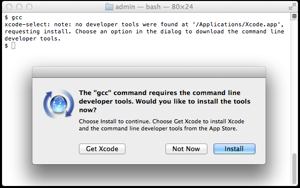
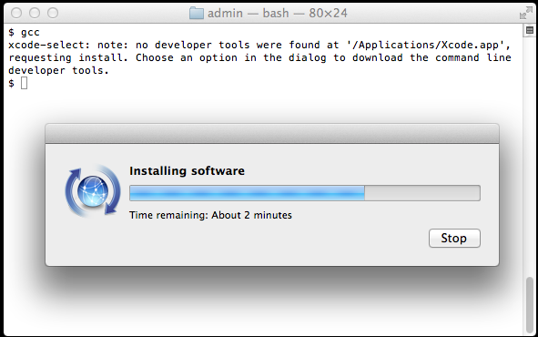

# ACME Auto Parts & Plumbing Corporation, Inc.

Welcome to ACME Auto Parts & Plumbing, a Wholly-Owned Subsidiary of ACME Bait & Tackle Corporation where quality is our #1 dream! This is the fictional repository for ACME Corp, Inc. DevOps Engineering team with a hypothetical software stack automated with Chef and pipelined with Jenkins running on Linux containers, or PipelineStack-in-a-Box.

This artistic rendering of a conceptual Chef development Workflow and accompanying environment with a Chef server, [ELKstack](elksack) ([Elasticsearch](elasticsearch), [Logstash](logstash), and [Kibana](kinana)), [Consul](consul) and [DockerUI](dockerui) running as Docker containers using [Google Kubernetes](kubernetes). While there is no single, prescribed right way, the right workflow is the one that works best for a specific team or a desired list of trendy buzzwords. What follows is the story of DevOps Team ACME and a solution they found suitable to their needs.

## Overview

As you commit Chef artifacts to git (i.e. cookbooks, data bags, environments and roles) the PipelineStack-in-a-Box will test and load them into its Chef server automatically. This will configure a Jenkins master and any number of Jenkins workers. By default, this uses SSH slaves (master initiated) as opposed to JNLP slaves (slave initiated) and relies on a git repository of your Chef items of the following structure:

 - **Berksfile:**
   - Contains all the cookbooks in your project.
   - Used to generate cookbook jobs for cookbooks that need testing.
   - Used to upload community cookbooks that don't need testing.
   - Assumes there is a 'community' or external group of cookbooks you want to deliver to the Chef server.
 - **environments/:** Directory of environment files in a format accepted by `knife upload`.
 - **roles/:** Directory of role files in a format accepted by `knife upload`.
 - **data_bags/:** Directory of data bag files in a format accepted by `knife upload`.

### Jobs

Two types of jobs exist; one to upload and test the Berksfile, environments, roles and data bags, the second one for uploading and testing a cookbook in our project, each configured to for watch for updates from their respective repositories and upload and run the jobs when changes are committed to git.

When the pipeline is up and had a couple minutes to settle down their will be a minimum of two jobs configured in the Jenkins dashboard, one for uploading all the roles, environments and data bags as well as cookbooks that bypass testing, and one or more to test our projects cookbooks.

 - **Chef Repo Job:**
   - Uploads roles, environments, data bags and community cookbooks from the git repo to the Chef server.
 - **Cookbook Jobs:**
   - Lint and test the respective cookbook;
	 - Runs knife test and Foodcritic;
	 - Checks for documented code using YARD.
	 - Runs unit tests using ChefSpec and RSpec.
	 - Runs integration tests with ServerSPEC.
   - Upload respective cookbook from git to the Chef server.

The docker containers used for this pipeline are somewhat unorthodox by design, because docker is so light-weight it provides and excellent platform for running a large number of simultaneous machines. As such they do not follow the considered normal good practice only running a single process per containers. Instead these are FatBoy™ containers, or containers that exists to run a couple of processes for a single isolated transient moment in time, complete with a process supervisor, SSH, [Consul](consul), cron, log rotation and NTP. Now these are perfect to test Chef cookbooks on!

## Usage

The first time you run PipelineStack-in-a-Box you may be required to enter in your password so that prerequisite software and system configuration can take place. It may also take a some time to launch the stack as several containers, Chef servers, Jenkins servers, etc. are all built and provisioned. In order to reduce the time a web caching proxy is used so that subsequent invocations of the pipeline will be much faster.

### Clone and run the ACME Pipeline Repository

The pipeline is composed of many separate git repos but only one is required to bootstrap the cluster. This is the primary top-level Chef repository for the ACME Bait & Tackle Corporation and all its subsidiaries containing all the Chef roles, Chef Environments, data bags and a Berksfile listing all the cookbooks in use by the ACME Global Organization.

Let's go ahead and clone the git repo then cd into the directory:

	$ git clone https://github.com/riddopic/thrashmaster
	$ cd thrashmaster


Next run the `setup.sh`

    stdout: [2015-06-09T14:09:26+00:00] INFO: Chef Run complete in 0.178823911 seconds
    stdout: [2015-06-09T14:09:26+00:00] INFO: Running report handlers
    stdout: [2015-06-09T14:09:26+00:00] INFO: Report handlers complete
    0 minutes ago, jenkins, centos 6.6.
    0 minutes ago, slave, ubuntu 14.04.
	
The next stop is to use Bundler to setup the Ruby environment:

	$ bundle install
	
Now we are going to use Bundler to invoke Brew and Cask to install any additional OS X applications:

	$ brew bundle Brewfile

You should now all the prerequisite software installed:


## Requirements

Before trying to build and use the containers make sure you have a supported
system. You will need docker, docker-machine, boot2docker, VirtualBox and/or
VMware Fusion and a handful of other tools. Play close attention to the specific
version numbers, generally speaking a newer version should be OK, an older
version must be upgraded. It is important to have matching compatible versions
of docker, docker-machine and boot2docker. At the time of this writing the
versions required are:

  - docker cli version 1.5.0:

        $ docker -v
        Docker version 1.5.0, build a8a31ef

  - docker-machine version 0.2.0

        $ docker-machine -v
        docker-machine version 0.2.0 (8b9eaf2)

  - boot2docker version 1.6.2

        $ boot2docker -v
        Boot2Docker-cli version: v1.6.2
        Git commit: cb2c3bc

Let's get started then, we are going to be doing the majority of our work inside
the terminal, the quickest way to open one is to use Spotlight; press Command
(⌘)-Space bar and type in "terminal" and slap that Enter key like you mean it!

### Xcode

1. First let's check if Xcode Already Installed, you don’t need the full Xcode package to get the Xcode Command Line Tools. However, you may have previously installed the full Xcode package.

  - To check if the full Xcode package is already installed:

		$ xcode-select -p

    If you see:

		/Applications/Xcode.app/Contents/Developer

      The full Xcode package is already installed. You will need to update Xcode to the newest version (Xcode 6.3.2 or newer). Go to the App Store application and check “Updates.” After updating Xcode, **be sure to launch the Xcode application and accept the Apple license terms.**

  - **If you see a file location that contains spaces in the path:**

        /Applications/Apple Dev Tools/Xcode.app/Contents/Developer

      You must delete Xcode. ChefDK and most command line tools will not work with spaces in the path. You can either install only the Xcode Command Line Tools (instructions below) or reinstalled the full Xcode package.

  - Installing Xcode is very simple, on Mac OS X Yosemite will alert you when you enter a command in the terminal that requires Xcode Command Line Tools, for example, you can enter `gcc`, `git`, or `make` and you will see an alert box:

      

  - Alternatively, you can use a command to install Xcode Command Line Tools. It will produce a similar alert box. Note the double hyphen:

		$ xcode-select --install

  - Click “Install” to download and install Xcode Command Line Tools. The instructions in the alert box are confusing. You don’t need to “Get Xcode” from the App Store. Just click “Install” for the Xcode Command Line Tools.

    

  - Verify that you’ve successfully installed Xcode Command Line Tools:

		$ xcode-select -p
        /Library/Developer/CommandLineTools

      Just to be certain, verify that gcc is installed:

        $ gcc --version
		Configured with: --prefix=/Library/Developer/CommandLineTools/usr --with-gxx-include-dir=/usr/include/c++/4.2.1
		Apple LLVM version 6.1.0 (clang-602.0.53) (based on LLVM 3.6.0svn)
		Target: x86_64-apple-darwin14.3.0
		Thread model: posix

2. Git is automatically installed as part of the Xcode Command Line Tools. Or, if you updated from a previous version of Mac OS X, you may have installed Git previously.

  - Check that Git is installed:

        $ git version
        git version 2.3.2 (Apple Git-55)

  - Configure Git if you haven’t used it before. First, list the current settings with the git config -l --global command. Then set user.name and user.email if necessary:

        $ git config -l --global
        fatal: unable to read config file '/Users/.../.gitconfig': No such file or directory

        $ git config --global user.name "Albert Einstein"
        $ git config --global user.email einstein@gmail.com
        $ git config --global color.ui true
        $ git config -l --global
        user.name=Albert Einstein
		user.email=einstein@gmail.com
		color.ui=true

  - If you don’t have an SSH key generated yet to use with Git you can create one:

        $ ssh-keygen -t rsa -C "einstein@gmail.com"

  - The next step is to take the newly generated SSH key and add it to your Github and/or Stash account. You want to copy and paste the output of the following command and paste it here for Github, Stash will have a similar page to enter your key but I will leave it up to you to find that link.

        $ cat ~/.ssh/id_rsa.pub

    Once you've done this, you can check and see if it worked:

        $ ssh -T git@github.com

    You should get a message like this:

        Hi aeinstein! You've successfully authenticated, but GitHub does not provide shell access.

    Now you’ll be ready to use Git when you need it.

## Automatic System Updates

In order to better support the running of the ACME Pipeline in-a-docker box several changes need to be made to your base system. These are mostly handled automatically for you when you run the build, what follows is a list of those changes and the reasoning behind them.

### SSH client configuration

Each time a container is created it is assigned new internal IP address. Over time these IP addresses will be reassigned to another containers. When that occurs SSH will alert you with a message similar to the one shown here. This also can occur on the same node if the host keys were removed as part of the lifecycle of the system. This is to guard and alert you to a change in the machine and is the best option from security point of view as it protect your system against any trojan horse attacks.

    @@@@@@@@@@@@@@@@@@@@@@@@@@@@@@@@@@@@@@@@@@@@@@@@@@@@@@@@@@@
	@    WARNING: REMOTE HOST IDENTIFICATION HAS CHANGED!     @
	@@@@@@@@@@@@@@@@@@@@@@@@@@@@@@@@@@@@@@@@@@@@@@@@@@@@@@@@@@@
	IT IS POSSIBLE THAT SOMEONE IS DOING SOMETHING NASTY!
	Someone could be eavesdropping on you right now (man-in-the-middle attack)!
	It is also possible that the RSA host key has just been changed.
	The fingerprint for the RSA key sent by the remote host is
	a7:a8:f2:97:94:33:58:b7:9d:bc:e0:a6:6b:f7:0a:29.
	Please contact your system administrator.
	Add correct host key in /home/user/.ssh/known_hosts to get rid of this message.
	Offending key in /home/user/.ssh/known_hosts:4
	RSA host key for acme.dev has changed and you have requested strict checking.
	Host key verification failed.

However the pipeline-in-a-docker box is only a local environment using a private network with little outside risk of trojans. Given this lower risk we configure the base host machine SSH _client_ to disable host key verification, and not to use the known_hosts file for *.acame.dev machines. (**Please note:** this does not apply to Windows/Putty).

	$ sudo tee ~/.ssh/config >/dev/null <<EOF
        Host *.acme.dev
		  User kitchen
	      StrictHostKeyChecking no
          UserKnownHostsFile /dev/null
    EOF
	
As these are ephemeral pipeline containers we do not create user accounts other than what is required for testing. As such we use the kitchen user if we need to interact with the container directly. The line `User kitchen` instructs the ssh client to connect as the kitchen user anytime a SSH connection is made to a `*.acme.dev` machine.
	
The equivalent could also be achieved using command line arguments as shown below:
	
	$ ssh -o StrictHostKeyChecking=no -o UserKnownHostsFile=/dev/null kitchen@box.acme.dev

# ___oxoXOXoxo___  ___oxoXOXoxo___  ___oxoXOXoxo___  ___oxoXOXoxo___  ___oxoXOXoxo___  ___oxoXOXoxo___
# ___oxoXOXoxo___  ___oxoXOXoxo___  ___oxoXOXoxo___  ___oxoXOXoxo___  ___oxoXOXoxo___  ___oxoXOXoxo___
# ___oxoXOXoxo___  ___oxoXOXoxo___  ___oxoXOXoxo___  ___oxoXOXoxo___  ___oxoXOXoxo___  ___oxoXOXoxo___
# ___oxoXOXoxo___  ___oxoXOXoxo___  ___oxoXOXoxo___  ___oxoXOXoxo___  ___oxoXOXoxo___  ___oxoXOXoxo___
# WTF CHUCK, NO GOT DOCKER YET BRODUDE?

Corrections:

	$ git clone https://github.com/riddopic/thrashmaster
	$ cd thrashmaster
	$ ruby -e "$(curl -fsSL https://raw.githubusercontent.com/Homebrew/install/master/install)"
	


### Shell Configuration

In order to interact with a docker-machine some environment variables need to be set in your shell. These variables can be obtained using the `docker-machine` command:

    $ docker-machine env dev
    export DOCKER_TLS_VERIFY=1
    export DOCKER_CERT_PATH="/Users/sharding/.docker/machine/machines/dev"
    export DOCKER_HOST=tcp://192.168.3.133:2376

Once the docker-machine is up we are going to modify the shell environment to point to this docker-machine instance;

 - To enable for just the current shell session, in sh, bash, and zsh:

       $ eval $(docker-machine env dev)

 - To permanently enable in sh, bash, and zsh (this will be done automatically for you but you will need to restart your shell):

       $ echo 'eval "$(docker-machine env dev)"' >> ~/.YOUR_SHELL_RC_FILE

 - Test to ensure everything is in order, running `docker ps` should produce similar output:

       $ docker ps
       CONTAINER ID        IMAGE            COMMAND            CREATED           STATUS                PORTS         NAMES

### Network Configuration

Next we are going to configure our network so that we can directly connect to the docker containers:

 - Create a route entry to the container network:

      	$ sudo route -n add 172.17.0.0/16 $(docker-machine ip)

 - Next we create an alias on our loopback interface. This will allow us to access our machine form the docker container network without having to worry about our IP primary address changing.

       $ sudo ifconfig lo0 alias 10.254.254.254

### Clone and run the ACME Pipeline Repository

The ACME Box in a Straw technology preview is composed of many separate git repos but only one is required to bootstrap the cluster. This is the primary top-level Chef repository for the ACME Bait & Tackle Corporation and all its subsidiaries containing all the Chef roles, Chef Environments, data bags and finally a Berksfile listing all the cookbooks in use by the ACME Global Organization.

Let's go ahead and clone the git repo:

	$ git clone https://github.com/riddopic/thrashmaster
	$ cd thrashmaster
	
The next stop is to use Bundler to setup the Ruby environment:

	$ bundle install
	
Now we are going to use Bundler to invoke Brew and Cask to install any additional OS X applications:

	$ brew bundle Brewfile

You should now all the prerequisite software installed:


If you haven't yet built the Docker containers you will need to do step 1 first,
if you already have the containers built skip ahead to step 3.

1. Start up a docker-machine with a generous helping of memory and disk (we are assigning 4GB or RAM and 40GB):

	* To start a VMware docker-machine:

          $ docker-machine create -d vmwarefusion \
			 --vmwarefusion-memory-size 4096 \
			 --vmwarefusion-disk-size 40960 \
			 --vmwarefusion-boot2docker-url \
			 https://github.com/boot2docker/boot2docker/releases/download/v1.6.2/boot2docker.iso \
			 dev

	* If your using VirtualBox the command to run is:

          $ docker-machine create -d virtualbox \
             --virtualbox-memory 4096 \
             --virtualbox-disk-size 40960 \
             --virtualbox-boot2docker-url \
             https://github.com/boot2docker/boot2docker/releases/download/v1.6.2/boot2docker.iso \
             dev

	* Once it's up let verify the host:

		  $ docker-machine ls
            NAME  ACTIVE  DRIVER        STATE    URL                       SWARM
            dev   *       vmwarefusion  Running  tcp://192.168.3.133:2376

2. Once the docker-machine is up we are going to modify the shell environment to point to this docker-machine instance;

	* To enable for just the current shell session, in sh, bash, and zsh:

          $ eval $(docker-machine env dev)

	* To permanently enable (**recommended**) in sh, bash, and zsh:

          $ echo 'eval "$(docker-machine env dev)"' >> ~/.YOUR_SHELL_RC_FILE

	* Test to ensure everything is in order, running `docker ps` should produce similar output:

          $ docker ps
            CONTAINER ID        IMAGE            COMMAND            CREATED           STATUS                PORTS         NAMES

3. Next we are going to configure our network so that we can directly connect to the docker containers:

	* Create a route entry to the container network:

           $ sudo route -n add 172.17.0.0/16 $(docker-machine ip)

	* Next we create an alias on our loopback interface. This will allow us to access our machine form the docker container network without having to worry about our IP primary address changing.

          $ sudo ifconfig lo0 alias 10.254.254.254


# xoXOXox

6. Make all target containers:

	$ make all

3. Clone the thrashmaster git repo and `bundle install` required gems:

	$ git clone https://github.com/riddopic/thrashmaster
	$ cd thrashmaster
	$ bundle install

4. Start the ACME Gas 'n' Go & Fine Wines, Inc. Pipeline in a Box where where
   quality is our #1 dream!:

	$ rake start

This can take some time depending on the speed of your machine and your network
connection. Once the task has completed it will have start several containers
and used Chef to bootstrap your Jenkins master and a slave node.

Container | ACME Pipeline Stack Description
------------ | -------------
`squid` | This container is configured as a caching web proxy using Squid.
`iptables` | This container is responsible for routing HTTP traffic to the cache.
`consul` | This container is responsible for DNS and service discover. You can connect to the consul UI via [http://consul.acme.dev:8500][]. By using the DNS server built into the Consul server you are able to to DNS resolution.
`chef` | This is the Chef 12 Server for the Pipeline stack.
`seagull` | Provides a friendly Web UI to monitor docker and get a visual representation of your running infrastructure.
`ElasticSearch` | Part of the ELKStack.
`LogStash` | Part of the ELKStack.
`Kibana` | Part of the ELKStack: [http://kibana.acme.com][]
`Jenkins` | Jenkins master: [http://jenkins.acme.com][]
`Slave` | Slave Jenkins worker


3. Homebrew (or brew) is a package manager for OS X, Cask is an extension to Homebrew that allows you to install graphical applications via the cli. Let's install them both:

   - To install Homebrew:

         $ ruby -e "$(curl -fsSL https://raw.githubusercontent.com/Homebrew/install/master/install)"

   - Next we use Homebrew to install Cask:

         $ brew install caskroom/cask/brew-cask


#### Starting a Docker Machine

We are going to launch our machine with 4GB of RAM and a 40GB volume using
version 1.6.2 of boot2docker:

##### VMware Workstation example:

    $ docker-machine create -d vmwarefusion \
      --vmwarefusion-memory-size 4096 \
      --vmwarefusion-disk-size 40000 \
      --vmwarefusion-boot2docker-url https://github.com/boot2docker/boot2docker/releases/download/v1.6.2/boot2docker.iso \
      dev

    INFO[0000] Downloading boot2docker.iso from https://github.com/boot2docker/boot2docker/releases/download/v1.6.2/boot2docker.iso...
    INFO[0014] Creating SSH key...
    INFO[0014] Creating VM...
    INFO[0014] Starting dev...
    INFO[0016] Waiting for VM to come online...
    INFO[0057] "dev" has been created and is now the active machine.
    INFO[0057] To point your Docker client at it, run this in your shell: docker-machine env dev | source

This will create a docker-machine named `dev` with the `vmwarefusion` complete
with 4GB of RAM and 40GB volume and have specified a URL for where to obtain the
boot2docker.ISO

##### VirtualBox example:

The default driver is Virtualbox and works virtually like the VMware driver
except where it doesn't.

    $ docker-machine create -d virtualbox \
    --virtualbox-memory 4096 \
    --virtualbox-disk-size 40960 \
    --virtualbox-boot2docker-url https://github.com/boot2docker/boot2docker/releases/download/v1.6.2/boot2docker.iso \
    dev

Once you docker-machine is up modify your shell environment to point to this
docker-machine instance;

To enable for just the current shell session, in sh, bash, and zsh:

    $ eval "$(docker-machine env dev)"

To permanently enable (**recommended**):

In sh, bash, and zsh:

    $ echo 'eval "$(docker-machine env dev)"' >> ~/.YOUR_SHELL_RC_FILE

Now check that your dockers are in order, first make sure your shell environment
settings are correctly setup by running:

    $ docker-machine ls
      NAME  ACTIVE  DRIVER        STATE    URL                       SWARM
      dev   *       vmwarefusion  Running  tcp://192.168.3.133:2376

Now let’s make sure you can connect to the machine via SSH:

    $ docker-machine ssh dev

                            ##        .
                      ## ## ##       ==
                   ## ## ## ##      ===
               /""""""""""""""""\___/ ===
          ~~~ {~~ ~~~~ ~~~ ~~~~ ~~ ~ /  ===- ~~~
               \______ o          __/
                 \    \        __/
                  \____\______/
     _                 _   ____     _            _
    | |__   ___   ___ | |_|___ \ __| | ___   ___| | _____ _ __
    | '_ \ / _ \ / _ \| __| __) / _` |/ _ \ / __| |/ / _ \ '__|
    | |_) | (_) | (_) | |_ / __/ (_| | (_) | (__|   <  __/ |
    |_.__/ \___/ \___/ \__|_____\__,_|\___/ \___|_|\_\___|_|
    Boot2Docker version 1.5.0, build vmw-1.5.0 : 67fcb7d - Wed Feb 18 10:00:58 UTC 2015
    Docker version 1.5.0, build a8a31ef
    docker@dev:~$

Finally, let’s try and launch a container:

    $ docker run -t -i centos:centos6 /bin/bash
    [root@fec71bd20e3c /]#

If all goes well you should find yourself in the shell of your newly created
CentOS container. Just type exit to go back to your normal shell and the machine
will then terminate. We can verify it has been shutdown with the docker command:

    $ docker ps -a
    CONTAINER ID        IMAGE               COMMAND                CREATED             STATUS                        PORTS               NAMES
    fec71bd20e3c        centos:centos6      "/bin/bash"            11 minutes ago      Exited (0) 11 minutes ago                         trusting_nobel

#### Configure Shell Environment for ChefDK Ruby

The ChefDK comes with it's own self-contained Ruby environment that plays well
with the rest of the Chef toolchain such as Berkshelf, Test Kitchen, ChefSpec
and Chef Provisioning. Activating the ChefDK Ruby environment in your shell is
done similarly to how it's done for docker-machine:

To enable for just the current shell session, in sh, bash, and zsh:

    $ eval "$(chef shell-init bash)"

In fish:

    $ eval (chef shell-init fish)

To permanently enable (**recommended**):

In sh, bash, and zsh:

    $ echo 'eval "$(chef shell-init SHELL_NAME)"' >> ~/.YOUR_SHELL_RC_FILE

In fish:

    $ echo 'eval (chef shell-init fish)' >> ~/.config/fish/config.fish

This will ensure SHELL PATH and ENVIRONMENT variables are configured correctly
for use with the ChefDK.

    $ which ruby
    /opt/chefdk/embedded/bin/ruby

Next we are going to bring up a virtual interface forAlias the loopback
interface. The reason for the loopback interface is to allow us to wildcard
*.dev record to go to a default address, for this we use the lo0 alias.

    $ sudo ifconfig lo0 alias 10.254.254.254

This then allows you to access your machine as with any *.dev domain.

    $ sudo route -n add 172.17.0.0/16 $(docker-machine ip)

In you `~/.ssh/config` ensure you have the following four lines:

Disable strict host key checking for SSH and connect as the kitchen user to our
docker instances:

    Host *.dev
      User kitchen
      StrictHostKeyChecking no
      UserKnownHostsFile /dev/null

Create the /etc/resolver directory and create the dev zone file:

    $ mkdir /etc/resolver
    $ echo "nameserver ${CONSUL_IP}" >> /etc/resolver/dev

What will now happen is any DNS lookups for the .dev top level domain will be
sent to the address listed in the /etc/resolver/dev file. The .dev domain had
for years been a private network which ICANN keep safe from the corporate
raiders. However recent changes in leadership at ICANN, bribes, corporate
raiding, user backlash and some the occasion blogger postings have lead to
the .dev domain fate being that of an unknown elephant waiting at the bus stop
for exact change.

### Chef 12 Server

Based off the Ubuntu 'FatBoy' 14.04 image, this image runs a Chef 12 Server, and
is specifically not configured with any redundancy nor is any of the data backed
up. This is purposefully done to ensure that it is regularly recycled and that
anything used to build the infrastructure is captured and automated.

#### Environment Variables

 - `PUBLIC_URL` - should be configured to a full public URL of the
   endpoint (e.g. `https://chef.mudbox.dev`)
 - `OC_ID_ADMINISTRATORS` - if set, it should be a comma-separated list of
   users that will be allowed to add oc_id applications (the Supermarket
   for example).

#### Ports

 - Ports 80 (HTTP) and  443 (HTTPS) are exposed.

#### Usage

To start the container `chef` with the hostname set to `chef.mudbox.dev`, using
the riddopic/chef-server base container:

    $ docker run -d --name chef -h chef.mudbox.dev \
      -e PUBLIC_URL=https://chef.mudbox.dev \
      -e OC_ID_ADMINISTRATORS=jenkins \
      riddopic/chef-server

#### Prerequisites and first start

The `kernel.shmmax` and `kernel.shmall` sysctl values should be set to
a high value on the docker-machine host.

To set the `kernel.shmmax` and `kernel.shmall` sysctl values run the following
on your docker hosts:

    $ docker-machine ssh dev -- sudo sysctl -w kernel.shmmax=17179869184
    $ docker-machine ssh dev -- sudo sysctl -w kernel.shmall=4194304

To make the change permanent add the values to `/etc/sysctl.con`:

    $ docker-machine ssh dev -- sudo sh -c 'kernel.shmmax=17179869184" >> sysctl.conf'
    $ docker-machine ssh dev -- sudo sh -c 'kernel.shmall=4194304"     >> sysctl.conf'

First start will automatically run `chef-server-ctl reconfigure`. Subsequent
starts will not run `reconfigure`, unless file `/var/opt/opscode/bootstrapped`
has been deleted. You can run `reconfigure` (e.g. after editing
`etc/chef-server.rb`) using `docker-enter`.

#### Maintenance commands

Use `docker exec` to run commands on your Chef server:

    $ docker exec $CONTAINER_ID chef-server-ctl status
    $ docker exec $CONTAINER_ID chef-server-ctl user-create …
    $ docker exec $CONTAINER_ID chef-server-ctl org-create …
    $ docker exec $CONTAINER_ID chef-server-ctl …

#### Building

    $ cd docker-containers/chef-server && make build

      Building chef-server container from Dockerfile:
        Repository:   [acme]
        Name:       [chef-server]
        Version:    [12.3]

      docker build -t riddopic/chef-server:12.3 .
      Sending build context to Docker daemon 32.26 kB
      Sending build context to Docker daemon
      Step 0 : FROM riddopic/ubuntu-14.04
       ---> fdf1de186398
      Step 1 : MAINTAINER Stefano Harding <riddopic@gmail.com>
       ---> Using cache
       ---> 57c555b6c956
      Step 2 : EXPOSE 80 443
       ---> Running in a37640aa6058
       ---> d7de20a31256
      Removing intermediate container a37640aa6058
      Step 3 : ENV ENV GOMAXPROCS=2 DEBIAN_FRONTEND=noninteractive KNIFE_HOME=/etc/chef
       ---> Running in b1052cb051e5
       ---> c93827c0de6c
      Removing intermediate container b1052cb051e5
      Step 4 : RUN apt-get-min update;
                   apt-get-install-min logrotate hardlink chef-server-core;
                   rm -rf /etc/opscode;
                   ln -sfv /var/opt/opscode/log /var/log/opscode;
                   ln -sfv /var/opt/opscode/etc /etc/opscode;
                   ln -sfv /opt/opscode/sv/logrotate /opt/opscode/service;
                   ln -sfv /opt/opscode/embedded/bin/sv /opt/opscode/init/logrotate;
                   chef-apply -e 'chef_gem "knife-opc"';
                   apt-get-min clean;
                   rm -rf /tmp/* /var/tmp/* /var/lib/apt/lists/* /var/cache/apt/archives/*
       ---> Running in c6b15e1e0192
      Get:1 http://mirrors.dev trusty InRelease [1730 B]
      Get:2 http://mirrors.dev trusty-updates InRelease [1762 B]
      Get:3 http://mirrors.dev trusty-security InRelease [1766 B]
      Get:4 http://mirrors.dev chef InRelease [1722 B]
      Get:5 http://mirrors.dev trusty/main amd64 Packages [9620 kB]
      Get:6 http://mirrors.dev trusty-updates/main amd64 Packages [1062 kB]
      Get:7 http://mirrors.dev trusty-security/main amd64 Packages [490 kB]
      Get:8 http://mirrors.dev chef/main amd64 Packages [1586 B]
      Fetched 11.2 MB in 1s (5943 kB/s)
      Reading package lists...
      Reading package lists...
      Building dependency tree...
      Reading state information...
      logrotate is already the newest version.
      The following NEW packages will be installed:
        chef-server-core hardlink
      0 upgraded, 2 newly installed, 0 to remove and 0 not upgraded.
      Need to get 460 MB of archives.
      After this operation, 1211 MB of additional disk space will be used.
      Get:1 http://mirrors.dev/ubuntu/public/ trusty/main hardlink amd64 0.2.0 [12.4 kB]
      Get:2 http://mirrors.dev/ubuntu/public/ chef/main chef-server-core amd64 12.0.8-1 [460 MB]
      Fetched 460 MB in 9s (46.4 MB/s)
      Selecting previously unselected package hardlink.
      (Reading database ... 29926 files and directories currently installed.)
      Preparing to unpack .../hardlink_0.2.0_amd64.deb ...
      Unpacking hardlink (0.2.0) ...
      Selecting previously unselected package chef-server-core.
      Preparing to unpack .../chef-server-core_12.0.8-1_amd64.deb ...
      Unpacking chef-server-core (12.0.8-1) ...
      Setting up hardlink (0.2.0) ...
      Setting up chef-server-core (12.0.8-1) ...
      Thank you for installing Chef Server!
      '/var/log/opscode' -> '/var/opt/opscode/log'
      '/etc/opscode' -> '/var/opt/opscode/etc'
      '/opt/opscode/service/logrotate' -> '/opt/opscode/sv/logrotate'
      '/opt/opscode/init/logrotate' -> '/opt/opscode/embedded/bin/sv'
      [2015-06-01T16:50:27+00:00] INFO: Run List is []
      [2015-06-01T16:50:27+00:00] INFO: Run List expands to []
      [2015-06-01T16:50:27+00:00] WARN: chef_gem[knife-opc] chef_gem compile_time installation is deprecated
      [2015-06-01T16:50:27+00:00] WARN: chef_gem[knife-opc] Please set `compile_time false` on the resource to use the new behavior.
      [2015-06-01T16:50:27+00:00] WARN: chef_gem[knife-opc] or set `compile_time true` on the resource if compile_time behavior is required.
      [2015-06-01T16:50:27+00:00] INFO: Processing chef_gem[knife-opc] action install ((chef-apply cookbook)::(chef-apply recipe) line 1)
      [2015-06-01T16:50:32+00:00] INFO: chef_gem[knife-opc] installed knife-opc at 0.3.1
      [2015-06-01T16:50:32+00:00] INFO: Processing chef_gem[knife-opc] action install ((chef-apply cookbook)::(chef-apply recipe) line 1)
       ---> ad7a4332229d
      Removing intermediate container c6b15e1e0192
      Step 5 : ADD root /
       ---> 5b5683a453b0
      Removing intermediate container aabfcf17679b
      Successfully built 5b5683a453b0

## System configuration

Alias the loopback interface, this allows for your docker machines to access
your OS X machine and provides a wildcard DNS lookup by including `address=/dev/
10.254.254.254` in our `dnsmasq.conf` file.

    $ sudo ifconfig lo0 alias 10.254.254.254

Create a route to the docker network you can access machines directly:

    $ sudo route -n add 172.17.0.0/16 $(docker-machine ip)

Configure SSH to be more tolerate of changing machines by disable strict host
key checking and also connect as the kitchen user to the docker containers in
the acme.dev domain by editing your `~/.ssh/config` file and ensure you have the
following four lines:

  Host *.acme.dev
      User kitchen
      StrictHostKeyChecking no
      UserKnownHostsFile /dev/null

Create the /etc/resolver directory and create the `dev` zone file:

  $ CONSUL_IP=$(docker inspect -f '{{.NetworkSettings.IPAddress}}' consul)
    $ sudo mkdir /etc/resolver
    $ echo "nameserver $CONSUL_IP" >> /etc/resolver/dev


```
To summarize simply put it's awesome, rockstar, superstar, ninja, cool guru showing a deep convergence of next-gen, bleeding-edge, synergistic styles. If you ever meet the guy who wrote Homebrew buy him a beer, he's the guru superstar rock-ninja of oracles.
```

## License and Authors

```
Author::   Stefano Harding <riddopic@gmail.com>
Copyright: 2014-2015, Stefano Harding

Licensed under the Apache License, Version 2.0 (the "License");
you may not use this file except in compliance with the License.
You may obtain a copy of the License at

    http://www.apache.org/licenses/LICENSE-2.0

Unless required by applicable law or agreed to in writing, software
distributed under the License is distributed on an "AS IS" BASIS,
WITHOUT WARRANTIES OR CONDITIONS OF ANY KIND, either express or implied.
See the License for the specific language governing permissions and
limitations under the License.
```


[ELKstack]:
[Elasticsearch]:
[Logstash]:
[Kibana]:
[Consul]:
[DockerUI]:
[Google Kubernetes]: http://www
[Berkshelf]: http://berkshelf.com "Berkshelf"
[Chef]: https://www.chef.io/chef/ "Chef"
[Serf]: https://www.serfdom.io "Serf"
[Consul]: https://www.consul.io "Consul"
[Alpine Linux]: https://www.alpinelinux.org "Alpine Linux"
[Seagull]: http://dockerseagull.com "Seagull"
[s6]: http://www.skarnet.org/software/s6/ "s6"
[Homebrew]: http://brew.sh "Homebrew"
[http://consul.acme.dev:8500]: http://consul.acme.dev:8500
[http://kibana.acme.com]: http://kibana.acme.com
[http://jenkins.acme.com]: http://jenkins.acme.com

[-][-][-][-][-][-][-][-]


